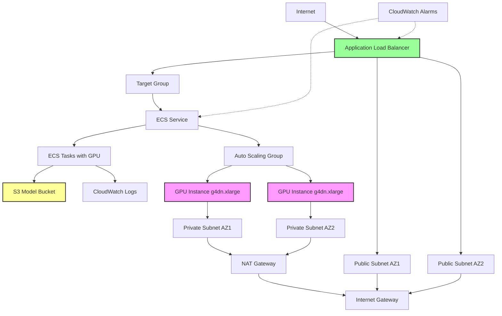

# GPU-Powered AI Inference API on AWS

A production-ready infrastructure for deploying GPU-accelerated AI inference workloads on AWS using Pulumi Infrastructure as Code.

## Architecture

This project deploys a complete, secure, and scalable GPU inference infrastructure with the following components:



### Key Components

#### Networking
- **VPC**: Isolated network with CIDR 10.0.0.0/16
- **Public Subnets**: 2 subnets across availability zones for load balancer
- **Private Subnets**: 2 subnets across availability zones for compute resources
- **NAT Gateway**: Enables outbound internet access for private resources
- **Internet Gateway**: Provides internet connectivity

#### Compute
- **ECS Cluster**: Container orchestration with Container Insights enabled
- **GPU Instances**: g4dn.xlarge instances with NVIDIA T4 GPUs
- **Auto Scaling Group**: Managed scaling from 1-3 instances
- **Capacity Provider**: ECS-managed scaling with target capacity tracking

#### Load Balancing
- **Application Load Balancer**: HTTP/HTTPS traffic distribution
- **Target Group**: Health-checked routing to ECS tasks
- **Security Groups**: Restricted ingress/egress rules

#### Storage
- **S3 Bucket**: Encrypted storage for ML models
  - Versioning enabled for model tracking
  - Lifecycle policies for old version cleanup
  - Server-side encryption (AES256)
  - Public access blocked

#### Security
- **IAM Roles**:
  - ECS Task Execution Role: Pull images, write logs
  - ECS Task Role: Access S3 models
  - EC2 Instance Role: ECS agent operations
- **Security Groups**: Minimal required access
- **Encryption**: At rest (S3, EBS) and in transit

#### Monitoring
- **CloudWatch Logs**: Centralized logging with 7-day retention
- **CloudWatch Alarms**:
  - CPU utilization > 80%
  - Memory utilization > 80%
  - Unhealthy target count < 1
- **Container Insights**: Enhanced ECS metrics

## Project Layout

```
gpu-inference-api-v2/
├── __main__.py           # Main Pulumi program
├── Pulumi.yaml           # Project configuration
├── Pulumi.dev.yaml       # Dev stack configuration
├── requirements.txt      # Python dependencies
├── .gitignore           # Git ignore rules
└── README.md            # This file
```

## Prerequisites

- [Pulumi CLI](https://www.pulumi.com/docs/get-started/install/) installed
- [AWS CLI](https://aws.amazon.com/cli/) configured with appropriate credentials
- Python 3.11 or later
- AWS account with permissions to create:
  - VPC, subnets, route tables, NAT/Internet gateways
  - ECS clusters, services, task definitions
  - EC2 instances, launch templates, auto scaling groups
  - Application Load Balancers, target groups
  - S3 buckets
  - IAM roles and policies
  - CloudWatch log groups and alarms

## Getting Started

### 1. Clone and Navigate

```bash
cd gpu-inference-api-v2
```

### 2. Create Virtual Environment

```bash
python3 -m venv .venv
source .venv/bin/activate  # On Windows: .venv\Scripts\activate
```

### 3. Install Dependencies

```bash
pip install -r requirements.txt
```

### 4. Configure Stack

```bash
# Initialize stack (if not already done)
pulumi stack init dev

# Set AWS region (optional, defaults to your AWS CLI region)
pulumi config set aws:region us-west-2
```

### 5. Deploy Infrastructure

```bash
pulumi up
```

Review the preview and confirm to deploy. The deployment takes approximately 10-15 minutes.

## Key Outputs

After deployment, Pulumi exports the following values:

| Output | Description |
|--------|-------------|
| `alb_url` | HTTP endpoint for the inference API |
| `alb_dns_name` | Load balancer DNS name |
| `model_bucket_name` | S3 bucket name for uploading models |
| `ecs_cluster_name` | ECS cluster name |
| `ecs_service_name` | ECS service name |
| `log_group_name` | CloudWatch log group name |
| `vpc_id` | VPC identifier |
| `public_subnet_ids` | Public subnet identifiers |
| `private_subnet_ids` | Private subnet identifiers |

### Accessing Outputs

```bash
# Get the API endpoint
pulumi stack output alb_url

# Get the model bucket name
pulumi stack output model_bucket_name

# Get all outputs as JSON
pulumi stack output --json
```

## Usage

### Uploading Models to S3

```bash
# Get bucket name
BUCKET=$(pulumi stack output model_bucket_name)

# Upload your model
aws s3 cp your-model.pt s3://$BUCKET/models/your-model.pt
```

### Accessing the API

```bash
# Get the endpoint URL
URL=$(pulumi stack output alb_url)

# Test the endpoint (once your application is deployed)
curl $URL/health
```

### Viewing Logs

```bash
# Get log group name
LOG_GROUP=$(pulumi stack output log_group_name)

# View recent logs
aws logs tail $LOG_GROUP --follow
```

### Monitoring

Access CloudWatch in the AWS Console to view:
- Container Insights dashboard for the ECS cluster
- Custom alarms for CPU, memory, and target health
- Log streams for individual tasks

## Customization

### Scaling Configuration

Modify the Auto Scaling Group in `__main__.py`:

```python
asg = aws.autoscaling.Group(
    "ecs-gpu-asg",
    desired_capacity=2,  # Change desired capacity
    max_size=5,          # Change maximum instances
    min_size=1,          # Change minimum instances
    ...
)
```

### Instance Type

Change the GPU instance type in `__main__.py`:

```python
launch_template = aws.ec2.LaunchTemplate(
    "ecs-gpu-launch-template",
    instance_type="g4dn.2xlarge",  # Use larger instance
    ...
)
```

Available GPU instance types:
- `g4dn.xlarge`: 1 GPU, 4 vCPUs, 16 GB RAM
- `g4dn.2xlarge`: 1 GPU, 8 vCPUs, 32 GB RAM
- `g4dn.4xlarge`: 1 GPU, 16 vCPUs, 64 GB RAM
- `g4dn.12xlarge`: 4 GPUs, 48 vCPUs, 192 GB RAM

### Container Configuration

Update the task definition in `__main__.py` to use your own container image:

```python
container_definitions=pulumi.Output.all(...).apply(
    lambda args: f'''[
        {{
            "name": "inference-api",
            "image": "your-registry/your-image:tag",
            ...
        }}
    ]'''
)
```

## Security Best Practices

This infrastructure implements several security best practices:

1. **Network Isolation**: Compute resources in private subnets
2. **Least Privilege IAM**: Minimal required permissions
3. **Encryption**: Data encrypted at rest and in transit
4. **Security Groups**: Restricted network access
5. **No Public IPs**: ECS tasks use NAT for outbound access
6. **Versioned Storage**: S3 versioning for model tracking
7. **Monitoring**: CloudWatch alarms for operational issues

## Cost Optimization

To minimize costs:

1. **Use Spot Instances**: Modify launch template to use spot instances
2. **Scale Down**: Reduce `desired_capacity` when not in use
3. **Lifecycle Policies**: S3 automatically cleans up old model versions
4. **Log Retention**: Logs retained for 7 days (configurable)

## Cleanup

To destroy all resources:

```bash
pulumi destroy
```

Confirm the deletion when prompted. This will remove all infrastructure created by this stack.

## Troubleshooting

### ECS Tasks Not Starting

Check CloudWatch logs:
```bash
aws logs tail $(pulumi stack output log_group_name) --follow
```

### Load Balancer Health Checks Failing

Verify the container is listening on port 8080 and responding to `/health` endpoint.

### GPU Not Available

Ensure you're using the ECS-optimized GPU AMI and the task definition includes GPU resource requirements.

### Deployment Timeout

GPU instances can take 5-10 minutes to join the cluster. Check the Auto Scaling Group in the AWS Console.

## Next Steps

1. **Deploy Your Application**: Update the task definition with your inference container
2. **Configure HTTPS**: Add an SSL certificate to the load balancer
3. **Set Up CI/CD**: Automate deployments with GitHub Actions or similar
4. **Add Auto Scaling**: Configure ECS service auto-scaling based on metrics
5. **Implement Authentication**: Add API authentication/authorization
6. **Set Up Monitoring**: Configure SNS notifications for CloudWatch alarms

## Support

For issues or questions:
- Review [Pulumi AWS Documentation](https://www.pulumi.com/docs/clouds/aws/)
- Check [AWS ECS Documentation](https://docs.aws.amazon.com/ecs/)
- Review [AWS GPU Instance Documentation](https://docs.aws.amazon.com/AWSEC2/latest/UserGuide/accelerated-computing-instances.html)

## License

This project is provided as-is for demonstration purposes.
