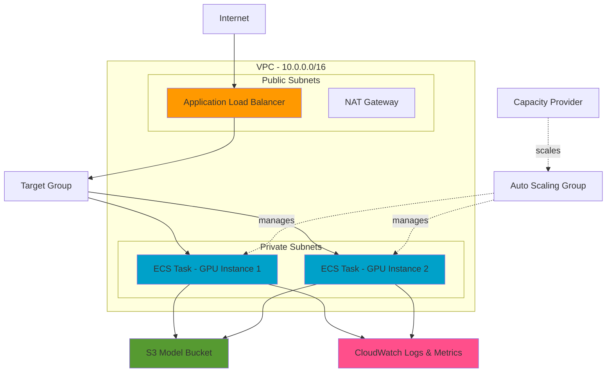

# GPU-Powered AI Inference API on AWS

A production-ready GPU inference API infrastructure built with Pulumi, featuring ECS with GPU instances, load balancing, auto-scaling, and comprehensive monitoring.

## Architecture Overview

This infrastructure deploys a highly available, scalable GPU inference API on AWS with the following components:



## Key Features

### Infrastructure
- **VPC with Multi-AZ**: Private and public subnets across 2 availability zones
- **GPU Instances**: g4dn.xlarge instances (NVIDIA T4 GPU, 4 vCPUs, 16 GB RAM)
- **Auto-Scaling**: Automatic scaling based on CPU and memory utilization
- **Load Balancing**: Application Load Balancer with health checks
- **Secure Storage**: Encrypted S3 bucket with versioning for ML models

### Security Best Practices
- Private subnets for compute resources
- Security groups with least-privilege access
- Encrypted EBS volumes and S3 buckets
- IAM roles with minimal permissions
- NAT Gateway for secure outbound traffic
- SSM Session Manager for debugging (no SSH required)

### Monitoring & Observability
- CloudWatch Container Insights enabled
- Custom CloudWatch alarms for:
  - High CPU utilization (>80%)
  - High memory utilization (>85%)
  - Unhealthy targets
  - ALB 5XX errors
- Centralized logging with CloudWatch Logs
- 7-day log retention

### Deployment
- Git-driven deployments with Pulumi
- ESC environment for AWS OIDC credentials
- GitHub Actions workflow for CI/CD
- Automatic preview on pull requests
- Automatic deployment on merge to main

## Project Structure

```
gpu-inference-api-v3/
├── __main__.py                 # Main Pulumi infrastructure code
├── Pulumi.yaml                 # Pulumi project configuration
├── Pulumi.dev.yaml            # Dev stack configuration with ESC environment
├── requirements.txt            # Python dependencies
├── .pulumi/
│   └── deploy.yaml            # Pulumi Deployments configuration
├── .github/
│   └── workflows/
│       └── pulumi.yml         # GitHub Actions workflow
├── app/
│   ├── main.py                # FastAPI application code
│   ├── requirements.txt       # Application dependencies
│   ├── Dockerfile             # Container image definition
│   └── .dockerignore          # Docker ignore patterns
└── README.md                  # This file
```

## Infrastructure Components

### Networking
- **VPC**: 10.0.0.0/16 CIDR block
- **Public Subnets**: 10.0.1.0/24, 10.0.2.0/24 (for ALB and NAT)
- **Private Subnets**: 10.0.11.0/24, 10.0.12.0/24 (for ECS instances)
- **Internet Gateway**: For public subnet connectivity
- **NAT Gateway**: For private subnet outbound access

### Compute
- **ECS Cluster**: With Container Insights enabled
- **Launch Template**: ECS-optimized GPU AMI with 100GB encrypted EBS
- **Auto Scaling Group**: 1-3 instances across private subnets
- **Capacity Provider**: Managed scaling at 80% target capacity

### Load Balancing
- **Application Load Balancer**: HTTP/HTTPS traffic distribution
- **Target Group**: Health checks on `/health` endpoint
- **Listener**: Port 80 forwarding to target group

### Storage
- **S3 Bucket**: Encrypted with AES256
- **Versioning**: Enabled for model version control
- **Lifecycle Policy**: Delete old versions after 90 days
- **Public Access**: Blocked at all levels

### IAM Roles
- **Task Execution Role**: For ECS agent operations
- **Task Role**: For application S3 and CloudWatch access
- **EC2 Instance Role**: For ECS cluster operations and SSM

## Key Outputs

After deployment, the following outputs are available:

| Output | Description |
|--------|-------------|
| `api_endpoint` | HTTP endpoint for the inference API |
| `alb_dns_name` | DNS name of the Application Load Balancer |
| `model_bucket_name` | S3 bucket name for storing ML models |
| `ecs_cluster_name` | Name of the ECS cluster |
| `ecs_service_name` | Name of the ECS service |
| `log_group_name` | CloudWatch log group name |
| `cloudwatch_dashboard_url` | Direct link to CloudWatch dashboard |
| `cloudwatch_logs_url` | Direct link to CloudWatch Logs Insights |

## Getting Started

### Prerequisites
- Pulumi CLI installed
- AWS credentials configured via ESC environment
- Python 3.11+ with pip

### Initial Setup

1. **Clone the repository**:
   ```bash
   cd gpu-inference-api-v3
   ```

2. **Create and activate virtual environment**:
   ```bash
   python3 -m venv .venv
   source .venv/bin/activate  # On Windows: .venv\Scripts\activate
   ```

3. **Install dependencies**:
   ```bash
   pip install -r requirements.txt
   ```

4. **Select the stack**:
   ```bash
   pulumi stack select dev
   ```

5. **Preview the infrastructure**:
   ```bash
   pulumi preview
   ```

6. **Deploy the infrastructure**:
   ```bash
   pulumi up
   ```

### Accessing the API

After deployment, get the API endpoint:
```bash
pulumi stack output api_endpoint
```

Test the health endpoint:
```bash
curl $(pulumi stack output api_endpoint)/health
```

Expected response:
```json
{"status": "healthy"}
```

### Deploying Your Model

1. **Upload your model to S3**:
   ```bash
   MODEL_BUCKET=$(pulumi stack output model_bucket_name)
   aws s3 cp your-model.pt s3://$MODEL_BUCKET/models/
   ```

2. **Update the application code** in `app/main.py` to load and use your model

3. **Build and push your container image** (or update the task definition to use your image)

4. **Deploy the updated infrastructure**:
   ```bash
   pulumi up
   ```

## Monitoring

### CloudWatch Dashboard
Access the ECS dashboard directly:
```bash
pulumi stack output cloudwatch_dashboard_url
```

### CloudWatch Logs
View application logs:
```bash
pulumi stack output cloudwatch_logs_url
```

Or use the CLI:
```bash
LOG_GROUP=$(pulumi stack output log_group_name)
aws logs tail $LOG_GROUP --follow
```

### Metrics to Monitor
- **CPU Utilization**: Should stay below 70% for optimal performance
- **Memory Utilization**: Should stay below 80% for optimal performance
- **GPU Utilization**: Monitor via custom metrics in your application
- **Request Latency**: Track P50, P95, P99 latencies
- **Error Rate**: Monitor 4XX and 5XX responses

## Scaling

### Manual Scaling
Update the desired count:
```bash
pulumi config set desiredCount 2
pulumi up
```

### Auto-Scaling
The infrastructure automatically scales based on:
- **CPU**: Scales out when average CPU > 70%
- **Memory**: Scales out when average memory > 80%
- **Cooldown**: 5 minutes scale-in, 1 minute scale-out

### Cost Optimization
- **Dev/Test**: Use 1 instance (current configuration)
- **Production**: Start with 2 instances for high availability
- **Peak Load**: Auto-scales up to 3 instances

## Security Considerations

### Network Security
- ECS instances in private subnets (no direct internet access)
- Security groups restrict traffic to ALB only
- NAT Gateway for outbound traffic (model downloads, API calls)

### Data Security
- S3 bucket encryption at rest (AES256)
- EBS volume encryption
- Secrets should be stored in AWS Secrets Manager or ESC
- IAM roles follow least-privilege principle

### Access Control
- No SSH access to instances (use SSM Session Manager)
- IAM roles for service-to-service authentication
- CloudWatch Logs for audit trails

## Troubleshooting

### Service Not Starting
1. Check ECS service events:
   ```bash
   aws ecs describe-services --cluster $(pulumi stack output ecs_cluster_name) \
     --services $(pulumi stack output ecs_service_name)
   ```

2. Check CloudWatch logs:
   ```bash
   aws logs tail $(pulumi stack output log_group_name) --follow
   ```

### Health Check Failures
1. Verify the `/health` endpoint responds:
   ```bash
   # SSH into instance via SSM
   curl http://localhost:8080/health
   ```

2. Check security group rules allow ALB traffic

### High Costs
1. Review instance count and types
2. Consider using Spot instances for non-production
3. Implement auto-scaling policies
4. Set up AWS Cost Anomaly Detection

## CI/CD with GitHub Actions

The project includes a GitHub Actions workflow that:
1. **On Pull Request**: Runs `pulumi preview` to show planned changes
2. **On Merge to Main**: Runs `pulumi up` to deploy changes

### Setup
1. Add `PULUMI_ACCESS_TOKEN` to GitHub repository secrets
2. Push changes to a feature branch
3. Create a pull request to main
4. Review the preview in PR comments
5. Merge to deploy automatically

## Cost Estimate

Approximate monthly costs for dev environment (1 instance):
- **g4dn.xlarge**: ~$180/month (on-demand)
- **NAT Gateway**: ~$32/month + data transfer
- **Application Load Balancer**: ~$16/month
- **EBS Storage (100GB)**: ~$10/month
- **S3 Storage**: Variable based on model size
- **CloudWatch**: ~$5/month for logs and metrics

**Total**: ~$243/month + data transfer and S3 storage

For production, multiply by instance count and add costs for:
- Additional availability zones
- Increased storage
- Data transfer
- CloudWatch alarms and dashboards

## Next Steps

1. **Deploy Your Model**: Upload your trained model to the S3 bucket
2. **Update Application**: Modify `app/main.py` to load and serve your model
3. **Add Authentication**: Implement API key or OAuth authentication
4. **Set Up Monitoring**: Configure CloudWatch alarms and dashboards
5. **Load Testing**: Test the API under expected load
6. **Production Deployment**: Create a prod stack with higher availability

## Support

For issues or questions:
- Check CloudWatch Logs for application errors
- Review ECS service events for deployment issues
- Consult AWS documentation for service-specific issues
- Review Pulumi documentation for infrastructure questions

## License

This project is provided as-is for demonstration purposes.
